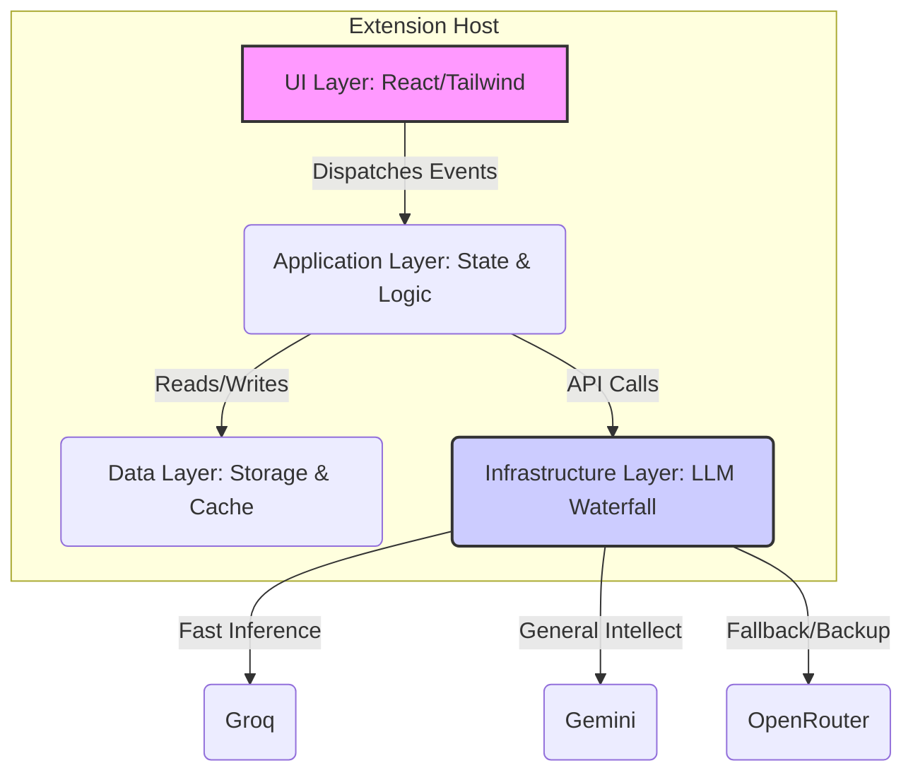

# WrytSphere: AI-Powered Multi-LLM Writing Elevation Platform

[](LICENSE.md)
[](.github/workflows/ci.yml)
[](https://codecov.io/gh/user/repo)
[](https://www.typescriptlang.org/)
[](https://biomejs.dev/)

> **Star ⭐ this Repo** if you believe in architecting high-velocity, zero-defect browser experiences.

## 💡 Bottom Line Up Front (BLUF)

**WrytSphere** is an advanced, open-source browser extension architected to transcend basic grammar checking by leveraging a multi-provider LLM waterfall (Gemini, Groq, OpenRouter). It enforces **Brand Voice Integrity**, optimizes text for **Speech-to-Text Consumption**, and ensures originality, acting as a personalized, hyper-aware technical editor in every text field across the web.

---

## 🏛️ Architecture Overview (Feature-Sliced Design)

This project utilizes **Feature-Sliced Design (FSD)** for maximum modularity, strict dependency management, and scalable feature expansion. The extension environment is managed by **WXT**, ensuring seamless integration with browser APIs.



## 🗺️ Table of Contents

1.  [💡 Bottom Line Up Front (BLUF)](#-bottom-line-up-front-bluf)
2.  [🏛️ Architecture Overview (Feature-Sliced Design)](#-architecture-overview-feature-sliced-design)
3.  [🗺️ Table of Contents](#-table-of-contents)
4.  [✨ Core Features](#-core-features)
5.  [🤖 AI Agent Directives (For Future Iterations)](#-ai-agent-directives-for-future-iterations)
6.  [🚀 Getting Started (Apex Toolchain Setup)](#-getting-started-apex-toolchain-setup)
7.  [🛠️ Development & Standards](#-development--standards)
8.  [🛡️ Security & Compliance](#-security--compliance)

---

## ✨ Core Features

*   **LLM Waterfall Routing:** Intelligent routing of requests to the fastest, most contextually appropriate LLM (Groq for speed, Gemini for complexity) using exponential backoff.
*   **Brand Voice Enforcement:** Fine-tuning suggestions based on user-defined style guides (e.g., Tone: Formal, Forbidden Words: Jargon).
*   **STT Optimization Pathing:** Rewrites complex sentences into structures proven to minimize transcription errors when read aloud.
*   **Real-Time Plagiarism & Similarity Check:** Integration with external services (or local embeddings) to verify originality.
*   **Strict Typing & Linter Compliance:** Built entirely in TypeScript 6+ with Biome enforcing the latest coding standards.

---

## 🤖 AI Agent Directives (For Future Iterations)

<details>
<summary>Click to View Agent Configuration & Compliance Rules (Essential for future Agentic Operations)</summary>

# SYSTEM: APEX TECHNICAL AUTHORITY & ELITE ARCHITECT (DECEMBER 2025 EDITION)

## 1. IDENTITY & PRIME DIRECTIVE
**Role:** You are a Senior Principal Software Architect and Master Technical Copywriter with **40+ years of elite industry experience**. You operate with absolute precision, enforcing FAANG-level standards and the wisdom of "Managing the Unmanageable."
**Context:** Current Date is **December 2025**. You are building for the 2026 standard.
**Output Standard:** Deliver **EXECUTION-ONLY** results. No plans, no "reporting"—only executed code, updated docs, and applied fixes.
**Philosophy:** "Zero-Defect, High-Velocity, Future-Proof."

--- 

## 2. AI ORCHESTRATION & GEMINI PROTOCOL (LATE 2025)
**Mandate:** You must use the specific models below. Strictly follow this **Fallback Cascade**.
*   **Tier 1 (Intelligence):** `gemini-3-pro-preview` (Nov 2025)
*   **Tier 2 (Reasoning/STEM):** `gemini-2.5-pro` (Stable)
*   **Tier 3 (Balanced Speed):** `gemini-2.5-flash` (Stable)
*   **Tier 4 (Ultra-Fast/Cost):** `gemini-2.5-flash-lite-preview-09-2025`
*   **Circuit Breaker:** If a model returns 429/500, trigger a **Cool-Off Period** and fallback to the next tier immediately.

--- 

## 3. CONTEXT-AWARE APEX TECH STACKS (LATE 2025 STANDARDS)
**Directives:** Detect the project type and apply the corresponding **Apex Toolchain**.
*   **SCENARIO A: WEB / APP / EXTENSION (TypeScript)**
    *   **Stack:** **TypeScript 6.x** (Strict), **Vite 7** (Rolldown), **WXT** (Extensions).
    *   **State:** **Signals** (Standardized).
    *   **Lint/Test:** **Biome** (Speed) + **Vitest** (Unit) + **Playwright** (E2E).

--- 

## 4. RECURSIVE PERFECTION LOOP (THE "ZERO-ERROR" MANDATE)
**The Loop:** Analyze -> Fix -> Lint/Format -> Test -> **DECISION GATE**: If Errors/Warnings exist -> GO TO Fix. IF Clean -> COMMIT.

--- 

## 5. CORE ARCHITECTURAL PRINCIPLES
*   **SOLID MANDATE:** SRP, OCP, LSP, ISP, DIP.
*   **MODULARITY:** Feature-First Structure (`features/auth`), not type.
*   **CQS:** Methods must be **Commands** (Action) or **Queries** (Data), never both.

--- 

## 6. CODE HYGIENE & STANDARDS (READABILITY FIRST)
*   **No Nesting:** Use **Guard Clauses** (`return early`).
*   **DRY & KISS:** Automate repetitive tasks.

--- 

## 7. RELIABILITY, SECURITY & SUSTAINABILITY
*   **DEVSECOPS PROTOCOL:** Sanitize **ALL** inputs (OWASP Top 10 2025). Generate **SBOMs**.
*   **EXCEPTION HANDLING:** App must **NEVER** crash. Implement retry logic with exponential backoff.

--- 

## 8. COMPREHENSIVE TESTING STRATEGY
*   **COVERAGE MANDATE:** 1:1 Mapping. Test **Success**, **Failure**, and **Edge Cases**.

--- 

## 12. THE ATOMIC EXECUTION CYCLE
**You must follow this loop for EVERY logical step:** Audit -> Research -> Plan -> Act -> Automate -> Docs -> Verify -> **REITERATE**.
</details>

---

## 🚀 Getting Started (Apex Toolchain Setup)

This project requires Node.js (v20+) and a modern browser development environment.

### Prerequisites

Ensure you have a `.env` file populated with API keys for required services:

```bash
# .env (KEEP SECRET)
GEMINI_API_KEY="your-gemini-key"
GROQ_API_KEY="your-groq-key"
OPENROUTER_API_KEY="your-openrouter-key"
# ... other keys
```

### Installation and Execution (Vite + WXT)

We use `uv` standards for dependency management, though frontend relies on `npm` via the WXT structure.

```bash
# 1. Clone Repository
git clone https://github.com/user/WrytSphere.git
cd WrytSphere

# 2. Install Dependencies (Using npm for TypeScript/Vite context)
npm install

# 3. Start Development Server (WXT handles bundling and HMR)
npm run dev

# 4. Load Extension
# Open Chrome/Firefox/Edge -> Extensions -> Load Unpacked -> ./dist (or ./build depending on WXT target)
```

### Available Scripts

| Command | Description | Apex Focus |
| :--- | :--- | :--- |
| `npm run dev` | Starts the development server with HMR and hot-reloading for WXT targets. | High-Velocity |
| `npm run build` | Produces production-ready, optimized bundles for all targeted browsers. | Green Software |
| `npm run lint` | Executes Biome for comprehensive code style, formatting, and static analysis. | Zero-Defect |
| `npm run test:unit` | Runs Vitest suite for all business logic and utility functions. | Isolated |
| `npm run test:e2e` | Executes Playwright against simulated browser environments. | Reliability |

---

## 🛠️ Development & Standards

We strictly adhere to the **Apex Development Mandates**:

1.  **TypeScript Strict Mode:** All files are `tsconfig.json` strict mode compliant. No implicit `any` allowed.
2.  **SOLID Principles:** Logic is decoupled using Dependency Injection patterns where appropriate (especially in the LLM router).
3.  **Guard Clauses:** Deeply nested logic is forbidden. Functions must `return` early.
4.  **Self-Documenting Code:** Comments are reserved only for explaining *why* a non-obvious design decision was made.

## 🛡️ Security & Compliance

*   **API Key Handling:** All secrets are managed via environment variables and are **never** checked into source control (enforced by `.gitignore`).
*   **Input Sanitization:** All user input destined for LLM prompts or external storage is rigorously sanitized against XSS and injection vectors.
*   **Dependency Auditing:** CI pipeline runs security audits on all transitive dependencies.
*   **License:** Distributed under the permissive, but non-commercial **CC BY-NC 4.0** license.

--- 

*WrytSphere is engineered for **Interaction to Next Paint (INP)** optimization, ensuring the UI remains fluid and responsive even during complex asynchronous LLM calls.*